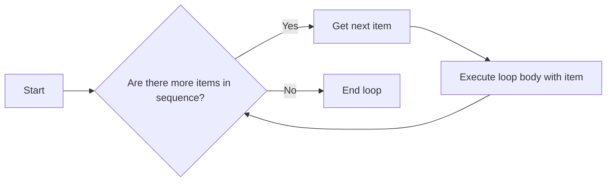

Excellent! Let's continue to elevate your Python mastery by delving into **"More Control Flow Tools"**.  Consider this section as upgrading your Python toolkit 🧰 with precision instruments 🛠️ for directing the flow of your programs.  We're moving beyond simple sequential execution to crafting logic with branches, loops, and reusable code blocks.

Think of "Control Flow" itself as the **navigation system 🧭 of your program**.  It dictates the order in which instructions are executed, allowing your program to make decisions, repeat tasks, and respond dynamically to different conditions.

## 4. More Control Flow Tools

This section expands your control over the execution path of your Python programs. It introduces powerful constructs that enable you to write more sophisticated and adaptable code.  It's about giving you the **steering wheel 🚗 and traffic rules 🚦** to guide your program's journey.

### 4.1. `if` Statements

`if` statements are the **decision-making units 🚦 of your code**. They allow your program to execute different blocks of code based on whether a condition is true or false.

Imagine an `if` statement as a **fork in the road 🛤️**.  Depending on a condition (like "Is it raining?"), you take one path or another.

**Structure of an `if` statement:**

```python
if condition:
    # Block of code to execute if condition is True
    statement1
    statement2
    ...
elif condition2: # Optional, can have zero or more 'elif' clauses
    # Block of code to execute if condition is False AND condition2 is True
    statement3
    statement4
    ...
else:           # Optional, at most one 'else' clause
    # Block of code to execute if ALL conditions are False
    statement5
    statement6
    ...
```

**Key Components:**

*   **`if` keyword:**  Starts the `if` block.
*   **`condition`:** An expression that evaluates to either `True` or `False` (Boolean value).
*   **Colon `:`:**  Marks the end of the condition and the beginning of the indented block.
*   **Indented Block:** The statements indented under the `if` line are executed *only if* the `condition` is `True`.
*   **`elif` keyword (else if):**  Optional. Provides additional conditions to check if the initial `if` condition is false. You can have multiple `elif` clauses.
*   **`else` keyword:** Optional. Provides a block of code to execute if *none* of the preceding `if` or `elif` conditions are true.

**Analogy:** Think of an `if-elif-else` structure as a **series of checkpoints or gates 🚪🚪🚪**.

1.  **`if condition:`**  "Is Gate 1 open (condition True)?" If yes, proceed through Gate 1's path.
2.  **`elif condition2:`** "If Gate 1 was closed, is Gate 2 open (condition2 True)?" If yes, proceed through Gate 2's path.
3.  **`else:`** "If both Gate 1 and Gate 2 were closed, take the default path (else block)."

**Example:**

```python
temperature = 25

if temperature > 30:
    print("It's hot!")
elif temperature > 20:
    print("It's warm.")
else:
    print("It's cool.")
```

**Flowchart Representation:**

```mermaid
graph LR
    A[Start] --> B{Temperature > 30?};
    B -- Yes --> C[Print "It's hot!"];
    B -- No --> D{Temperature > 20?};
    D -- Yes --> E[Print "It's warm."];
    D -- No --> F[Print "It's cool."];
    C --> G[End];
    E --> G;
    F --> G;
```

**Emoji Summary for `if` statements:** 🚦 Decision, 🛤️ Fork in road, 🚪 Gates,  ✅ True path, ❌ False path.

### 4.2. `for` Statements

`for` loops are designed for **iteration 🔄 over a sequence** (like a list, tuple, string, or range). They allow you to execute a block of code repeatedly for each item in the sequence.

Imagine a `for` loop as a **conveyor belt 🏭**.  Items are placed on the belt (the sequence), and for each item, a process (the loop body) is performed.

**Structure of a `for` loop:**

```python
for item in sequence:
    # Block of code to execute for each 'item' in 'sequence'
    statement1
    statement2
    ...
```

**Key Components:**

*   **`for` keyword:** Starts the `for` loop.
*   **`item`:**  A variable that takes on the value of each item in the `sequence` during each iteration of the loop.
*   **`in` keyword:**  Indicates that you are iterating *through* the `sequence`.
*   **`sequence`:** An iterable object (e.g., list, tuple, string, range).
*   **Colon `:`:** Marks the end of the `for` line and the beginning of the indented block.
*   **Indented Block:** The statements indented under the `for` line are executed *once for each item* in the `sequence`.

**Analogy:** Think of a `for` loop as **processing items in a basket 🧺 one by one**.

1.  **`for item in basket:`** "For each item I pick out from the basket..."
2.  **`# process item`** "...do something with this item (loop body)."
3.  Repeat until all items in the basket are processed.

**Example:**

```python
fruits = ["apple", "banana", "cherry"]
for fruit in fruits:
    print(fruit)
```

**Output:**

```
apple
banana
cherry
```

**Flowchart Representation:**



**Emoji Summary for `for` loops:** 🔄 Iteration, 🏭 Conveyor belt, 🧺 Basket of items,  🚶‍♂️ Process each item,  🔁 Repeat.

### 4.3. The `range()` Function

The `range()` function is a powerful tool for creating **sequences of numbers 🔢**, often used in `for` loops when you need to iterate a specific number of times or over a numerical range.

`range()` generates a sequence of numbers, but it doesn't store all the numbers in memory at once. It produces them on demand, which is very memory-efficient, especially for large ranges.

**Syntax of `range()`:**

*   `range(stop)`: Generates numbers from `0` up to (but not including) `stop`, with a step of `1`.
*   `range(start, stop)`: Generates numbers from `start` up to (but not including) `stop`, with a step of `1`.
*   `range(start, stop, step)`: Generates numbers from `start` up to (but not including) `stop`, with a step of `step`.

**Examples:**

```python
>>> range(5)
range(0, 5)  # Not a list, but a 'range' object

>>> list(range(5)) # To see the numbers, convert to a list
[0, 1, 2, 3, 4]

>>> list(range(2, 7))
[2, 3, 4, 5, 6]

>>> list(range(0, 10, 2)) # Step of 2
[0, 2, 4, 6, 8]

>>> list(range(5, 0, -1)) # Counting down (negative step)
[5, 4, 3, 2, 1]
```

**Using `range()` in `for` loops:**

```python
for i in range(5): # Iterate 5 times (from 0 to 4)
    print(i)

for i in range(1, 4): # Iterate from 1 to 3
    print(i)
```

**Analogy:** `range()` is like a **number sequence generator 🔢 or a counter**. You tell it where to start, where to stop, and how to increment (step), and it produces the sequence of numbers.

**Emoji Summary for `range()` function:** 🔢 Number sequence,  ⚙️ Generator,  ⏱️ Counter,  🔁 For loops,  📈 Numerical range.

### 4.4. `break` and `continue` Statements

`break` and `continue` are control statements used to **alter the normal flow of loops**. They provide more granular control over iteration.

*   **`break` statement:**  Immediately **terminates the loop 🛑** it is in and jumps to the statement immediately following the loop. Think of it as an "emergency stop button" for a loop.
*   **`continue` statement:**  **Skips the rest of the current iteration ⏭️** and proceeds to the next iteration of the loop. Think of it as a "skip this item and move to the next" instruction.

**Analogy:** Imagine you are working on an assembly line 🏭 (a loop):

*   **`break`**: If you encounter a critical issue, you press the **emergency stop button 🛑**, halting the entire assembly line (loop).
*   **`continue`**: If you find a defective item on the line, you **skip it ⏭️** and continue processing the rest of the items (move to the next iteration).

**Example of `break`:**

```python
for i in range(10):
    if i == 5:
        break # Exit the loop when i is 5
    print(i)
print("Loop finished.")
```

**Output:**

```
0
1
2
3
4
Loop finished.
```

**Example of `continue`:**

```python
for i in range(10):
    if i % 2 == 0: # If i is even
        continue # Skip even numbers
    print(i) # Print only odd numbers
print("Loop finished.")
```

**Output:**

```
1
3
5
7
9
Loop finished.
```

**Flowchart Representation for `break` and `continue` in a `for` loop:**

```mermaid
graph LR
    A[Start loop iteration] --> B{Condition for break?};
    B -- Yes --> F[Exit loop (break)];
    B -- No --> C{Condition for continue?};
    C -- Yes --> A[Next iteration (continue)];
    C -- No --> D[Execute loop body];
    D --> E[End of loop body];
    E --> A;
    F --> G[Code after loop];
```

**Emoji Summary for `break` and `continue`:** 🛑 Emergency Stop, ⏭️ Skip item,  🔄 Loop control,  💥 Terminate loop (`break`),  ➡️ Next iteration (`continue`).

### 4.5. `else` Clauses on Loops

Python allows `else` clauses not only with `if` statements but also with loops (`for` and `while`).  The `else` clause in a loop is executed **when the loop completes its iterations normally**, i.e., without encountering a `break` statement.

Think of the `else` clause on a loop as a **"loop completion signal" 🏁**.  It's like saying, "If the loop finished all its iterations without being interrupted, then do this (the `else` block)."

**`for...else` example:**

```python
for n in range(2, 10):
    for x in range(2, n):
        if n % x == 0:
            print(f"{n} equals {x} * {n//x}")
            break # Not a prime number, break out of inner loop
    else: # else clause of the inner for loop
        # loop fell through without finding a factor
        print(f"{n} is a prime number")
```

**Explanation:**

*   The outer `for` loop iterates through numbers from 2 to 9.
*   The inner `for` loop checks if `n` has any factors between 2 and `n-1`.
*   If a factor is found (`n % x == 0`), it means `n` is not prime, so `break` is executed to exit the inner loop.
*   If the inner loop completes *without* finding any factors (i.e., no `break` is executed), the `else` clause of the inner loop is executed, indicating that `n` is prime.

**`while...else` example:**

```python
count = 0
while count < 3:
    print(f"Count is: {count}")
    count += 1
    # No break statement in this loop
else:
    print("While loop completed normally (count is no longer < 3).")
```

**Analogy:** `else` on a loop is like a **"task completion flag 🏁" in a process**.

1.  **Start a task (loop).**
2.  **Perform steps in the task (loop iterations).**
3.  **Did the task complete successfully without interruptions (no `break`)?**
    *   **Yes:** Raise the "task completed" flag 🏁 (execute `else` block).
    *   **No (interrupted by `break`):** No flag raised, skip `else` block.

**Important Note:** The `else` clause is **not executed** if the loop is terminated by a `break` statement.

**Emoji Summary for `else` on loops:** 🏁 Loop completion signal,  ✅ Normal loop finish,  ❌ No `break`,  📜 After loop success,  ⚠️ Not executed after `break`.

### 4.6. `pass` Statements

The `pass` statement is a **null operation** in Python. It does nothing when executed. It's used as a **placeholder 🚧** where a statement is syntactically required but you don't want to execute any code.

Think of `pass` as a **"do-nothing" instruction 🚧** or a placeholder in a plan that you intend to fill in later.

**Common Uses:**

*   **Empty function or class bodies:**

    ```python
    def my_function():
        pass  # Placeholder, function body to be implemented later

    class MyClass:
        pass  # Placeholder, class definition to be filled in later
    ```

*   **Empty `if` blocks or loop bodies (when syntactically required):**

    ```python
    if condition:
        pass  # Placeholder, action to be taken later if condition is true
    else:
        print("Condition is false.")

    for item in sequence:
        if some_condition(item):
            pass # Placeholder, action for specific items
        else:
            process_item(item)
    ```

*   **Ignoring exceptions temporarily:**

    ```python
    try:
        # Some code that might raise an exception
        risky_operation()
    except SomeException:
        pass  # Ignore this exception for now (use with caution!)
    ```

**Analogy:** `pass` is like a **"placeholder note" 📝 in your code**. You know something needs to be done there, but you're not ready to write the actual code yet. It's like saying, "I'll come back and fill this in later."

**Emoji Summary for `pass` statement:** 🚧 Placeholder, 📝 Note to self,  😶 Do nothing,  🕳️ Empty space,  ⏳ To be filled later.

### 4.7. `match` Statements (Python 3.10+)

Introduced in Python 3.10, `match` statements provide **structural pattern matching**. It's a powerful way to **compare a value against several patterns 🎛️** and execute different code blocks based on which pattern matches.

Think of `match` as a **sophisticated switchboard 🎛️ or a pattern recognition system**. You provide an input value, and it checks if it matches any of the defined patterns, then routes the execution accordingly.

**Basic Structure:**

```python
match value:
    case pattern1:
        # Code block for pattern1
        statement1
        ...
    case pattern2:
        # Code block for pattern2
        statement2
        ...
    case _: # Wildcard pattern (default case)
        # Code block if no other pattern matches
        statement3
        ...
```

**Key Features:**

*   **`match value:`:**  Starts the `match` block, specifying the value to be matched against patterns.
*   **`case pattern:`:**  Defines a pattern to compare against the `value`.
*   **Indented Block:**  Code to execute if the `value` matches the `pattern`.
*   **`_` (Wildcard pattern):**  Matches any value. It acts as a default case, similar to `else` in `if-elif-else` or `default` in switch statements in other languages.

**Types of Patterns:**

*   **Literal patterns:** Match specific values (numbers, strings, booleans, `None`).

    ```python
    match status_code:
        case 200:
            print("OK")
        case 404:
            print("Not Found")
        case _:
            print("Unknown status code")
    ```

*   **Variable patterns:** Capture the matched value into a variable.

    ```python
    match point:
        case (0, 0):
            print("Origin")
        case (x, 0): # Captures x-coordinate
            print(f"On the x-axis at x={x}")
        case (0, y): # Captures y-coordinate
            print(f"On the y-axis at y={y}")
        case (x, y): # Captures both coordinates
            print(f"Point at x={x}, y={y}")
    ```

*   **Wildcard pattern `_`:** Matches any value, often used as the default case.

*   **Sequence patterns (lists, tuples):** Match against sequences of a specific structure.

    ```python
    match command:
        case ["load", filename]:
            print(f"Load command for file: {filename}")
        case ["save"]:
            print("Save command")
        case _:
            print("Unknown command")
    ```

*   **Mapping patterns (dictionaries):** Match against dictionaries with specific keys and optionally values.

*   **Class patterns (for object type and attributes matching):** More advanced, for matching object types and attribute values.

**Analogy:** `match` statement is like a **sophisticated sorting machine 🎛️ for different types of items**.

1.  **Input item (value).**
2.  **Check against a series of pattern detectors (case patterns).**
3.  **If a pattern matches, route the item to the corresponding processing station (case block).**
4.  **If no specific pattern matches, route to the default station (wildcard `_` case).**

**Flowchart Representation (Simplified for Literal Patterns):**

```mermaid
graph LR
    A[Input Value] --> B{Pattern 1 Match?};
    B -- Yes --> C[Execute Code Block 1];
    B -- No --> D{Pattern 2 Match?};
    D -- Yes --> E[Execute Code Block 2];
    D -- No --> F{... More Patterns ...};
    F --> G{Wildcard Pattern (_) Match?};
    G -- Yes --> H[Execute Default Code Block];
    G -- No --> I[No Pattern Matched];
    C --> J[End Match];
    E --> J;
    H --> J;
    I --> J;
```

**Emoji Summary for `match` statement:** 🎛️ Pattern matching,  🧩 Structure,  🔍 Compare patterns,  🚦 Multi-way decision,  ✨ Powerful in Python 3.10+.

### 4.8. Defining Functions

Functions are fundamental building blocks in programming. They are **reusable blocks of code** that perform a specific task. Functions promote **modularity, code reusability, and readability**.

Think of a function as a **mini-program or a subroutine 🍲 within your main program**. You give it some input (arguments), it performs a set of operations, and may return an output (result).

**Function Definition Syntax:**

```python
def function_name(parameter1, parameter2, ...):
    """Docstring: Function's documentation (optional but highly recommended)"""
    # Function body - code to be executed
    statement1
    statement2
    ...
    return result # Optional return statement
```

**Key Components:**

*   **`def` keyword:**  Starts a function definition.
*   **`function_name`:**  The name you give to your function (following naming conventions).
*   **`(parameter1, parameter2, ...)`:**  Parentheses containing zero or more parameters (input variables) that the function accepts. Parameters are optional.
*   **Colon `:`:** Marks the end of the function signature and the beginning of the function body.
*   **Docstring `"""..."""`:**  Optional but highly recommended documentation string that describes what the function does, its parameters, and what it returns.
*   **Function Body (Indented Block):** The code that gets executed when the function is called.
*   **`return result` (Optional):**  The `return` statement specifies the value that the function sends back as its result. If there's no `return` statement, the function implicitly returns `None`.

**Function Call:**

To execute a function, you need to **call** it by using its name followed by parentheses `()` and providing any required arguments.

```python
result = function_name(argument1, argument2, ...)
```

**Analogy:** Think of a function as a **recipe 🍲**.

1.  **Function Definition (`def ...`)**:  Writing down the recipe – listing ingredients (parameters) and steps to follow (function body).
2.  **Function Call (`function_name(...)`)**:  Following the recipe to cook the dish – providing the ingredients (arguments) and getting the cooked dish (return value).

**Example:**

```python
def greet(name):
    """This function greets the person passed in as a parameter."""
    print(f"Hello, {name}!")

greet("Alice") # Calling the function with argument "Alice"
greet("Bob")   # Calling it again with "Bob"
```

**Diagrammatic Representation of Function Definition and Call:**

```mermaid
graph LR
    A[Function Definition: def function_name(parameters): ...] --> B[Function Body (Code)];
    C[Function Call: result = function_name(arguments)] --> D[Execute Function Body];
    D --> E{Return Value?};
    E -- Yes --> F[Return result to caller];
    E -- No --> G[Implicitly return None];
    F --> H[Result assigned to variable 'result'];
    G --> H;
```

**Emoji Summary for Defining Functions:** 🍲 Recipe,  🛠️ Reusable block,  📦 Modularity,  ➡️ Input (parameters/arguments),  ⬅️ Output (return value),  📜 Function definition,  📞 Function call.

### 4.9. More on Defining Functions

This section delves deeper into the nuances of function definitions, exploring different ways to define parameters and pass arguments, providing flexibility and control over function behavior.

#### 4.9.1. Default Argument Values

You can specify **default values for function parameters**. If an argument for a parameter with a default value is not provided in the function call, the default value is used.

**Syntax:**

```python
def function_name(parameter1, parameter2=default_value, ...):
    # Function body
    ...
```

**Example:**

```python
def power(base, exponent=2): # 'exponent' has a default value of 2
    """Calculates base to the power of exponent."""
    return base ** exponent

print(power(5))      # Uses default exponent (2): 5**2 = 25
print(power(5, 3))   # Overrides default exponent: 5**3 = 125
```

**Important Rules for Default Values:**

*   Default values are evaluated **only once**, at the point of function definition. This can be important for mutable default arguments (like lists or dictionaries), as they can retain state between function calls if modified within the function.
*   Parameters with default values must come **after** parameters without default values in the function definition.

**Analogy:** Default argument values are like **pre-set options or default settings ⚙️ on a device**.  For example, a printer might have a default print quality setting. You can use the default, or you can override it and choose a different setting when you use the printer.

**Emoji Summary for Default Argument Values:** ⚙️ Default settings,  🔧 Optional parameters,  ✅ Use default if not provided,  🔄 Evaluated once at definition,  ⚠️ Be careful with mutable defaults.

#### 4.9.2. Keyword Arguments

When calling a function, you can provide arguments using **keyword arguments**.  This means you explicitly specify the parameter name along with the value. Keyword arguments make function calls more **readable and self-documenting**, and they allow you to pass arguments in any order.

**Syntax:**

```python
function_name(parameter_name1=value1, parameter_name2=value2, ...)
```

**Example:**

```python
def describe_person(name, age, city):
    """Prints information about a person."""
    print(f"Name: {name}, Age: {age}, City: {city}")

describe_person(name="Alice", age=30, city="New York") # Keyword arguments
describe_person(age=25, city="London", name="Bob")   # Order doesn't matter with keywords
describe_person("Charlie", 35, "Paris")               # Positional arguments (order matters)
```

**Rules for Keyword Arguments:**

*   Keyword arguments must follow positional arguments in a function call.
*   All keyword arguments passed must match one of the parameters accepted by the function.
*   No parameter can receive a value more than once (e.g., by both positional and keyword argument).

**Analogy:** Keyword arguments are like **filling out a form 📝 with labeled fields**. You explicitly write the field name (parameter name) and then fill in the value (argument).  The order in which you fill out the fields doesn't matter as long as you correctly label each field.

**Emoji Summary for Keyword Arguments:** 📝 Form with labels,  🏷️ Parameter names as labels,  🔄 Order independent,  ✅ Readability,  ✨ Self-documenting calls.

#### 4.9.3. Special parameters

Python offers special syntax to define the **kind of arguments** a function expects. This provides fine-grained control over how arguments can be passed (positional, keyword, or both).

Python defines three types of special parameters:

1.  **Positional-or-Keyword Arguments:** (Default type) Can be passed either positionally or as keyword arguments.
2.  **Positional-Only Parameters:** Must be passed *positionally*.
3.  **Keyword-Only Arguments:** Must be passed as *keyword arguments*.

These are defined using special symbols in the function parameter list:

*   **`/` (Positional-Only delimiter):** Parameters *before* `/` are positional-only.
*   `*` **(Keyword-Only delimiter):** Parameters *after* `*` are keyword-only.

##### 4.9.3.1. Positional-or-Keyword Arguments

These are the **standard, most common type of parameters**.  If no special syntax is used, parameters are positional-or-keyword by default.  You can pass arguments to these parameters either by position or by keyword.

**Example (most functions we've seen so far are of this type).**

##### 4.9.3.2. Positional-Only Parameters

Parameters defined *before* the `/` symbol in the function parameter list are **positional-only**.  They *must* be passed as positional arguments in the function call.  You cannot use keyword arguments for them.

**Syntax:**

```python
def function_name(positional_only_param1, positional_only_param2, /, positional_or_keyword_param1, ...):
    # Function body
    ...
```

**Example (Illustrative, but less common in user-defined functions in this specific form):**

```python
def positional_only_example(pos_only1, pos_only2, /, pos_or_kw):
    """Example with positional-only parameters."""
    print(f"pos_only1: {pos_only1}, pos_only2: {pos_only2}, pos_or_kw: {pos_or_kw}")

positional_only_example(1, 2, 3)          # OK: Positional for all
positional_only_example(1, 2, pos_or_kw=3) # OK: Positional for positional-only, keyword for pos/kw
# positional_only_example(pos_only1=1, pos_only2=2, pos_or_kw=3) # Error! Cannot use keywords for positional-only
TypeError: positional_only_example() got some keyword arguments for positional-only parameters: 'pos_only1, pos_only2'
```

**Use Cases for Positional-Only:**

*   When parameter names are not as meaningful or important as their position (e.g., mathematical functions).
*   When you want to prevent parameter names from being part of the public API, allowing you to change parameter names in the future without breaking compatibility.

##### 4.9.3.3. Keyword-Only Arguments

Parameters defined *after* the `*` symbol in the function parameter list are **keyword-only**.  They *must* be passed as keyword arguments in the function call.  You cannot use positional arguments for them.

**Syntax:**

```python
def function_name(positional_or_keyword_param1, *, keyword_only_param1, keyword_only_param2, ...):
    # Function body
    ...
```

**Example:**

```python
def keyword_only_example(pos_or_kw, *, kw_only1, kw_only2):
    """Example with keyword-only parameters."""
    print(f"pos_or_kw: {pos_or_kw}, kw_only1: {kw_only1}, kw_only2: {kw_only2}")

keyword_only_example(1, kw_only1="a", kw_only2="b") # OK: Positional for pos/kw, keyword for keyword-only
# keyword_only_example(1, "a", "b") # Error! Keyword-only must be keywords
TypeError: keyword_only_example() missing 2 required keyword-only arguments: 'kw_only1' and 'kw_only2'
keyword_only_example(pos_or_kw=1, kw_only1="a", kw_only2="b") # OK: All keyword arguments
```

**Use Cases for Keyword-Only:**

*   When you want to enforce clarity and readability for certain parameters, especially optional or configuration-like parameters.
*   When you want to prevent ambiguity or accidental misordering of arguments, particularly when there are many parameters.

##### 4.9.3.4. Function Examples

Let's combine these special parameter types in a single example:

```python
def combined_example(pos_only, /, pos_or_kw, *, kw_only):
    """Combines positional-only, positional-or-keyword, and keyword-only parameters."""
    print(f"pos_only: {pos_only}, pos_or_kw: {pos_or_kw}, kw_only: {kw_only}")

combined_example(1, 2, kw_only=3)         # OK
combined_example(1, pos_or_kw=2, kw_only=3) # OK
# combined_example(1, kw_only=3, pos_or_kw=2) # Error! Positional argument follows keyword argument
# combined_example(pos_only=1, pos_or_kw=2, kw_only=3) # Error! positional-only parameter
TypeError: combined_example() got some keyword arguments for positional-only parameters: 'pos_only'
# combined_example(1, 2, 3) # Error! keyword-only argument missing
TypeError: combined_example() missing 1 required keyword-only argument: 'kw_only'
```

##### 4.9.3.5. Recap

**Parameter Types Summary:**

| Parameter Type           | How to Pass Arguments | Defined By          | Use Cases                                                              |
| :----------------------- | :-------------------- | :------------------ | :----------------------------------------------------------------------- |
| Positional-or-Keyword   | Positional or Keyword | Default (no symbol) | Most common type, flexible argument passing.                            |
| Positional-Only         | Positional Only       | Before `/`          | For function API stability, when names are less important than position. |
| Keyword-Only            | Keyword Only          | After `*`           | For clarity, to enforce parameter naming, avoid ambiguity.               |

**Analogy for Special Parameters:** Imagine different types of **input channels 🎛️ on a sophisticated device (function)**.

*   **Positional-or-Keyword:**  Like a standard input jack that can accept input in multiple ways (positional or named connection).
*   **Positional-Only:** Like a specific input slot that *only* works with a direct, positional connection (like a dedicated power cable slot).
*   **Keyword-Only:** Like a configuration dial or setting that *must* be adjusted by its label (keyword) – you can't just guess and turn it to a position.

**Diagrammatic Representation of Parameter Types:**

```mermaid
graph LR
    A[Function Parameters] --> B{Positional-or-Keyword (Default)};
    A --> C{Positional-Only (/ delimiter)};
    A --> D{Keyword-Only (* delimiter)};
    B --> E[Flexible: Positional OR Keyword arguments];
    C --> F[Strict: Positional arguments ONLY];
    D --> G[Strict: Keyword arguments ONLY];
```

**Emoji Summary for Special Parameters:** 🎛️ Input Channels,  ✅ Flexible (Positional-or-Keyword),  📍 Positional-Only,  🏷️ Keyword-Only,  🔒 Control over argument passing.

#### 4.9.4. Arbitrary Argument Lists

Python allows functions to accept a **variable number of arguments** using `*args` (for positional arguments) and `**kwargs` (for keyword arguments).

*   **`*args` (Arbitrary Positional Arguments):**  Collects extra positional arguments into a tuple named `args`.

    ```python
    def my_function(*args):
        """Accepts arbitrary number of positional arguments."""
        for arg in args:
            print(arg)

    my_function(1, 2, 3)    # args will be (1, 2, 3)
    my_function("a", "b")   # args will be ("a", "b")
    my_function()          # args will be an empty tuple ()
    ```

*   **`**kwargs` (Arbitrary Keyword Arguments):** Collects extra keyword arguments into a dictionary named `kwargs`.

    ```python
    def my_function(**kwargs):
        """Accepts arbitrary number of keyword arguments."""
        for key, value in kwargs.items():
            print(f"{key} = {value}")

    my_function(name="Alice", age=30) # kwargs will be {'name': 'Alice', 'age': 30}
    my_function(city="London")         # kwargs will be {'city': 'London'}
    my_function()                     # kwargs will be an empty dictionary {}
    ```

**Analogy:** Arbitrary argument lists are like having **flexible containers 📦 for extra ingredients 🍎🍋🌶️ in your recipe**.

*   `*args`:  A basket 🧺 for extra positional ingredients (you just throw them in).
*   `**kwargs`: A labeled box 🗃️ for extra keyword ingredients (you put them in with labels, like 'spice=chili').

**Combining `*args` and `**kwargs`:**

You can use both `*args` and `**kwargs` in the same function definition to accept any number of positional and keyword arguments.  They are typically placed last in the parameter list.

```python
def combined_args_kwargs(arg1, arg2, *args, **kwargs):
    """Example combining regular, *args, and **kwargs."""
    print(f"arg1: {arg1}, arg2: {arg2}")
    print("Extra positional args (*args):", args)
    print("Extra keyword args (**kwargs):", kwargs)

combined_args_kwargs(1, 2, 3, 4, name="Alice", city="New York")
```

**Emoji Summary for Arbitrary Argument Lists:** 📦 Flexible containers,  🧺 `*args` (positional),  🗃️ `**kwargs` (keyword),  ➕ Variable number of arguments,  ✨ Function versatility.

#### 4.9.5. Unpacking Argument Lists

You can "unpack" argument lists when calling a function using `*` and `**` operators.

*   **`*` operator (List/Tuple Unpacking):** Unpacks a list or tuple into positional arguments.

    ```python
    def my_function(a, b, c):
        print(f"a={a}, b={b}, c={c}")

    args_list = [1, 2, 3]
    my_function(*args_list) # Unpacks list into a, b, c
    # Equivalent to: my_function(1, 2, 3)

    args_tuple = (4, 5, 6)
    my_function(*args_tuple) # Unpacks tuple into a, b, c
    # Equivalent to: my_function(4, 5, 6)
    ```

*   **`**` operator (Dictionary Unpacking):** Unpacks a dictionary into keyword arguments.

    ```python
    def my_function(name, age, city):
        print(f"Name: {name}, Age: {age}, City: {city}")

    kwargs_dict = {'name': 'Alice', 'age': 30, 'city': 'New York'}
    my_function(**kwargs_dict) # Unpacks dictionary into name, age, city keywords
    # Equivalent to: my_function(name='Alice', age=30, city='New York')
    ```

**Analogy:** Unpacking argument lists is like **distributing items from a container 📦 to function parameters**.

*   `*` unpacking: Taking items from a list or tuple and handing them out as positional arguments.
*   `**` unpacking: Taking key-value pairs from a dictionary and handing them out as keyword arguments.

**Emoji Summary for Unpacking Argument Lists:** 📦 Distribute from container,  🎁 `*` unpack list/tuple,  🗂️ `**` unpack dictionary,  ➡️ Arguments to function,  ✨ Convenient argument passing.

#### 4.9.6. Lambda Expressions

Lambda expressions create **anonymous functions** – small, unnamed functions that can be defined inline. They are often used for short, simple operations.

**Syntax:**

```python
lambda parameters: expression
```

*   **`lambda` keyword:** Starts a lambda expression.
*   **`parameters`:**  Comma-separated list of parameters (like in a regular function).
*   **Colon `:`:** Separates parameters from the expression.
*   **`expression`:** A single expression that is evaluated and returned as the function's result. Lambda functions can only contain a single expression.

**Example:**

```python
square = lambda x: x * x  # Lambda function to square a number
print(square(5)) # Output: 25

add = lambda x, y: x + y    # Lambda function to add two numbers
print(add(3, 7))    # Output: 10
```

**Use Cases for Lambda Functions:**

*   **Short, simple operations:** When you need a function for a quick, one-line task.
*   **Callback functions:** Passing functions as arguments to other functions (e.g., `sorted()`, `map()`, `filter()`).
*   **Creating small, throwaway functions without needing to define them formally with `def`.**

**Analogy:** Lambda functions are like **quick, disposable tools 🛠️ for a very specific, simple task**.  Like a small, single-use wrench or screwdriver – you use it for one job and then might not need it again in the same way.

**Emoji Summary for Lambda Expressions:** 🛠️ Quick tool,  😶 Anonymous function,  inline,  ⚡️ Short and simple,  ➡️ Single expression,  ✨ Concise function definition.

#### 4.9.7. Documentation Strings (Docstrings)

Docstrings are **documentation strings** used to document Python code, especially functions, classes, and modules. They are written as the **first statement inside the definition** using triple quotes `"""..."""`.

Docstrings are used to:

*   **Explain what a function, class, or module does.**
*   **Describe parameters, return values, and any important behavior.**
*   **Generate automatic documentation (e.g., using Sphinx).**
*   **Provide help information when using `help()` function.**

**Example:**

```python
def my_function(param1, param2):
    """
    This is a docstring for my_function.

    It explains what the function does, what parameters it takes,
    and what it returns.

    Args:
        param1: Description of parameter 1.
        param2: Description of parameter 2.

    Returns:
        Description of the return value.
    """
    # Function body
    return param1 + param2

help(my_function) # Access the docstring using help()
```

**Docstring Conventions:**

*   **First line:** Should be a concise summary of the object's purpose.
*   **Blank line:** Leave a blank line after the summary line.
*   **Detailed description:** Follow with a more detailed explanation, including parameters, return values, exceptions, etc. (following conventions like reStructuredText or NumPy/SciPy docstring style).

**Analogy:** Docstrings are like the **user manual 📖 or description label 🏷️ for your function (or class, module)**.  They tell others (and your future self) how to use and understand your code.

**Emoji Summary for Documentation Strings:** 📖 User manual,  🏷️ Description label,  📝 Code documentation,  📚 Explain function purpose,  ✨ Improve code understanding.

#### 4.9.8. Function Annotations

Function annotations are **metadata** that provide **type hints** and other information about function parameters and return values. Annotations are written using a colon `:` after parameter names and `->` before the return value in the function definition.

**Syntax:**

```python
def function_name(param1: type_hint, param2: type_hint = default_value) -> return_type_hint:
    # Function body
    ...
```

**Example:**

```python
def greet(name: str, greeting: str = "Hello") -> str:
    """Greets a person with a specified greeting."""
    return f"{greeting}, {name}!"

print(greet("Alice"))       # Output: Hello, Alice!
print(greet("Bob", "Hi")) # Output: Hi, Bob!
```

**Key Points about Annotations:**

*   Annotations are **optional**.
*   Python **does not enforce** type annotations at runtime by default. They are primarily for documentation, static analysis (type checkers like MyPy), and IDE support.
*   Annotations can be any Python expression, but type hints (like `str`, `int`, `list`, `dict`, etc.) are the most common use.

**Analogy:** Function annotations are like **labels or notes 🏷️📝 attached to function parameters and return values**, indicating their expected types or other properties.  They are like metadata that helps understand the function's interface, but they don't change how the function runs at its core (in standard Python).

**Emoji Summary for Function Annotations:** 🏷️ Labels,  📝 Notes,  ℹ️ Metadata,  ✅ Type hints,  ✨ Documentation and static analysis.

### 4.10. Intermezzo: Coding Style

This section is a brief **interlude on coding style**. It emphasizes the importance of writing **readable and maintainable code**.  Python's style guide, **PEP 8**, is recommended as a set of conventions to follow.

**Key Aspects of Coding Style (following PEP 8):**

*   **Readability:** Code should be easy to read and understand by humans (not just computers).
*   **Consistency:** Follow consistent style conventions throughout your codebase and across projects.
*   **Indentation:** Use 4 spaces for indentation (not tabs).
*   **Line Length:** Limit lines to 79 characters (or 99 for comments and docstrings in some cases).
*   **Blank Lines:** Use blank lines to separate logical sections of code.
*   **Comments:** Write clear and concise comments to explain non-obvious parts of the code.
*   **Naming Conventions:** Use descriptive and consistent names for variables, functions, classes, etc. (e.g., snake_case for variables and functions, CamelCase for classes).
*   **Whitespace:** Use whitespace around operators and after commas for better readability.

**Analogy:** Coding style is like **writing style guidelines ✍️ for code** – like grammar, punctuation, and formatting in written language.  Good coding style is like writing clearly and grammatically correct prose, making your code easier for others (and yourself) to read and maintain.  PEP 8 is like a style manual or code etiquette guide.

**Emoji Summary for Coding Style:** ✍️ Writing style,  📏 PEP 8 guidelines,  ✅ Readability,  ✨ Maintainability,  🤝 Code etiquette,  👍 Best practices.

**In Conclusion:**

This extensive section on "More Control Flow Tools" has equipped you with a powerful set of instruments for directing the execution of your Python programs and defining reusable, well-structured functions. You now have a much richer understanding of:

*   **Decision making (`if`, `elif`, `else`)**
*   **Iteration (`for`, `range()`)**
*   **Loop control (`break`, `continue`, `else` on loops)**
*   **Pattern matching (`match` - Python 3.10+)**
*   **Function definition (parameters, arguments, return values, docstrings, annotations)**
*   **Advanced function parameter types (positional-only, keyword-only)**
*   **Arbitrary argument lists (`*args`, `**kwargs`) and unpacking**
*   **Anonymous functions (`lambda`)**
*   **Coding style (PEP 8)**

You've moved far beyond basic operations and are now wielding the tools of a proficient Python programmer!  This detailed exploration should solidify your understanding and enable you to write more complex and elegant Python code.  Let me know if you'd like to dive deeper into any of these concepts or move on to the next stage of your Python journey! 🚀🎉