Certainly! Let's delve into Chapter 3, "Controlling the Flow 🚦 - Decision Making and Loops," with a highly detailed and professional approach, ensuring complete clarity for a developer of your caliber.

## Chapter 3: "Controlling the Flow 🚦 - Decision Making and Loops" - An In-Depth Developer's Perspective

In the landscape of software architecture, the concept of "control flow" is paramount. It's the very essence of program execution logic, dictating the order in which instructions are executed and enabling programs to behave dynamically based on conditions and data. Without robust control flow mechanisms, our code would be relegated to static, linear execution, incapable of handling the complexities and nuances of real-world applications. Chapter 3 elucidates the fundamental constructs that empower us to orchestrate this control – **Conditional Statements** and **Loops**. Consider these not merely as language features, but as core architectural patterns for building intelligent and responsive systems.

### 3.1 Conditional Statements: Making Decisions 🤔 (If-Else Branches) - The Branching Logic Paradigm

**Concept:** Conditional statements are the embodiment of **decision-making** within your code. They introduce a non-linear execution path, allowing your program to dynamically choose between different code blocks based on the evaluation of Boolean expressions.  Think of this as implementing selective logic – executing specific routines only when predetermined conditions are met. This is not just about branching; it's about embedding intelligent responsiveness into your application's core logic.

**Analogy:  Sophisticated Traffic Management System 🚦 at a Multi-Way Intersection 🌐**

Imagine a complex urban intersection, not just a simple fork.  A sophisticated traffic management system (your conditional structure) is in place to optimize traffic flow.

*   **`if` condition (Primary Route Prioritization):** The system first checks for **high-priority conditions** – perhaps an emergency vehicle approaching 🚨. " **IF** an emergency vehicle is detected (condition is TRUE), **THEN** clear all lanes and prioritize its passage (execute `if` block)."

*   **`elif` conditions (Secondary Route Evaluations):**  If no emergency, the system then evaluates **secondary priority conditions** – perhaps rush hour traffic in a specific direction 🚗🚗🚗. "**ELSE IF** it's rush hour on Avenue A (previous `if` was FALSE, and this `elif` condition is TRUE), **THEN** allocate more green light time to Avenue A (execute `elif` block)."  You can have multiple `elif` layers, each representing a tiered priority evaluation.

*   **`else` condition (Default Route Handling):**  If none of the high or secondary priority conditions are met (no emergency, not rush hour on any prioritized avenue), the system falls back to a **default traffic management strategy** 🚦. "**ELSE** (all preceding `if` and `elif` conditions are FALSE), **THEN** operate under standard traffic light timings (execute `else` block)." This ensures a baseline operation even when specific conditions are absent.

**Explanation Breakdown (Technical Precision):**

*   **`if` statement - Predicate-Based Execution:** The `if` statement evaluates a **predicate** – a Boolean expression that resolves to either `True` or `False`.  If the predicate evaluates to `True`, the associated indented code block is executed. This is a fundamental mechanism for implementing condition-dependent operations.

    ```python
    transaction_amount = 1500
    account_balance = 2000
    if transaction_amount <= account_balance: # Predicate: Is transaction_amount less than or equal to account_balance?
        print("Transaction approved. ✅") # Execute if predicate is True
        account_balance -= transaction_amount # Update account balance
    ```

*   **`elif` (else if) statement - Sequential Condition Cascading:** `elif` introduces a chain of conditional checks.  It is evaluated **only if** the preceding `if` and any preceding `elif` conditions were `False`. This creates a sequential decision tree, where each `elif` represents an alternative condition to be tested in order.  This is crucial for handling mutually exclusive scenarios or prioritized condition evaluations.

    ```python
    http_status_code = 404
    if http_status_code == 200:
        print("Success: Request fulfilled. 👍")
    elif http_status_code == 404: # Evaluated only if http_status_code != 200
        print("Error: Resource not found. ⚠️")
    elif http_status_code == 500: # Evaluated only if previous conditions were False
        print("Error: Internal server error. ❌")
    # ... further elif conditions for other status codes ...
    ```

*   **`else` statement - Contingency Execution Path:** The `else` block serves as the **default execution path**. It is executed if and only if **all** preceding `if` and `elif` conditions evaluate to `False`. This ensures that in any scenario, at least one code block within the conditional structure is executed, providing a robust fallback mechanism.

    ```python
    user_role = "guest"
    if user_role == "admin":
        print("Access granted: Administrator privileges. 👑")
    elif user_role == "editor":
        print("Access granted: Content editor privileges. ✍️")
    else: # Executed if user_role is neither "admin" nor "editor"
        print("Access denied: Insufficient privileges. 🔒") # Default path for unhandled roles
    ```

*   **Indentation - Syntactic Block Delimitation 📏:**  In Python, indentation is not merely a stylistic choice; it is **syntactically significant**.  Indentation defines the **scope** of code blocks associated with `if`, `elif`, and `else` statements. Consistent and correct indentation is critical for the Python interpreter to correctly parse and execute your conditional logic.  Think of indentation as the **structural grammar** of your control flow, dictating how blocks of code are grouped and related within the decision-making process.  Incorrect indentation leads to `IndentationError` and fundamentally flawed program logic.

**Structure & Visual (Enhanced Flowchart):**

```mermaid
graph LR
    A[Start] --> B{Condition 1? 🤔};
    B -- Yes ✅ --> C[Code Block 1 🧱];
    B -- No ❌ --> D{Condition 2? 🤔};
    D -- Yes ✅ --> E[Code Block 2 🧱];
    D -- No ❌ --> F[Else Block 🧱];
    C --> G[End 🏁];
    E --> G;
    F --> G;

    style B fill:#f9f,stroke:#333,stroke-width:2px
    style D fill:#f9f,stroke:#333,stroke-width:2px
    style C fill:#ccf,stroke:#333,stroke-width:2px
    style E fill:#ccf,stroke:#333,stroke-width:2px
    style F fill:#ccf,stroke:#333,stroke-width:2px
    style G fill:#cfc,stroke:#333,stroke-width:2px
```



**Decision Tree Perspective (Abstract Representation):**

Conditional statements architect a decision tree within your program. Each `if` or `elif` acts as a node, branching the execution path based on the outcome of the condition evaluation. The `else` branch represents the default leaf node, ensuring a path is always taken. This tree structure allows for complex, multi-layered decision-making processes within your code.

### 3.2 Loops: Repeating Actions 🔄 (Repetitive Tasks) - Iterative Processing Paradigm

**Concept:** Loops are fundamental control flow structures designed for **iteration** – executing a block of code repeatedly. They are essential for automating repetitive tasks, processing collections of data, and implementing algorithms that require iterative refinement. Loops embody the principle of **algorithmic efficiency**, allowing you to express complex, repetitive operations concisely and effectively.

**Analogy: Automated Robotic Assembly Line 🤖🏭**

Consider a modern robotic assembly line in a factory.

*   **`for` loop (Item-Based Processing Line):** Imagine a conveyor belt carrying individual items (data elements) – say, components for a product. A series of robotic stations (code block) are set up along the belt.  The `for` loop is analogous to this line. "**FOR EACH** component arriving on the belt (iterate through a sequence), **PROCESS** it at each robotic station (execute code block)."  The loop automatically iterates through each item in the sequence, applying the same processing logic to each.

*   **`while` loop (Condition-Driven Quality Control Loop):** Now, consider a quality control station at the end of the assembly line. A sensor continuously monitors the product's quality (condition). "**WHILE** the quality is below the target threshold (condition is TRUE), **PERFORM** adjustments and re-tests (execute code block, potentially adjusting parameters that will eventually make the condition FALSE)." The `while` loop continues to execute as long as the condition (quality below threshold) remains true, representing a condition-driven iterative process until a desired state is achieved.

**Explanation Breakdown (Technical Precision):**

*   **`for` loop - Sequence Iteration Protocol:** The `for` loop is designed for iterating over **iterable objects** – any object that can return its elements one at a time (e.g., lists, tuples, strings, ranges, dictionaries, sets).  It implements the **iterator protocol**, automatically handling the process of fetching each element from the sequence and assigning it to a loop variable. This simplifies iteration and makes it highly readable and efficient.

    ```python
    data_points = [25, 67, 89, 42, 95]
    for point in data_points: # Iterate over each 'point' in the 'data_points' list
        processed_value = point * 2 # Perform processing on each point
        print(f"Processed value: {processed_value}") # Output the result
    ```

*   **`while` loop - Condition-Controlled Repetition Cycle:** The `while` loop executes a code block **repeatedly as long as** a specified condition (Boolean expression) evaluates to `True`. This is ideal for scenarios where the number of iterations is not predetermined but depends on reaching a certain state or condition.  It's crucial to ensure that within the `while` loop's code block, there is a mechanism to eventually make the condition `False`, preventing **infinite loops**, which can lead to program crashes or unresponsive behavior.

    ```python
    target_accuracy = 0.99
    current_accuracy = 0.85
    iterations = 0
    while current_accuracy < target_accuracy: # Condition: Is current_accuracy less than target_accuracy?
        # ... (Machine Learning model training code to improve accuracy) ...
        current_accuracy += 0.05 # Simulate accuracy improvement (in real scenario, model training would update accuracy)
        iterations += 1
        print(f"Iteration {iterations}: Accuracy = {current_accuracy:.2f}")
    print(f"Target accuracy reached after {iterations} iterations.")
    ```

*   **`break` statement - Premature Loop Termination Signal 🚪:**  The `break` statement provides a mechanism for **immediate loop exit**. When encountered within a loop (either `for` or `while`), `break` terminates the loop execution **regardless of the loop's normal termination condition**. Program control then transfers to the statement immediately following the loop. This is essential for handling exceptional conditions or implementing early exit strategies based on runtime logic.

*   **`continue` statement - Iteration Skip Directive ⏭️:** The `continue` statement alters the flow within a loop by **skipping the remainder of the current iteration** and proceeding directly to the **next iteration**.  When `continue` is executed, the code block following it within the current iteration is bypassed, and the loop proceeds to evaluate the loop condition (in `while` loops) or fetch the next item (in `for` loops).  This is useful for filtering data or handling specific cases within a loop without terminating the entire loop.

**Visuals (Enhanced Flowcharts):**

*   **`for` loop Visual:**

    ```mermaid
    graph LR
        A[Sequence: [Item 1 📦, Item 2 📦, Item 3 📦, ...]] --> B{Next Item? 🤔};
        B -- Yes ✅ --> C[Process Item ⚙️];
        C --> B;
        B -- No ❌ --> D[End 🏁];
        style B fill:#f9f,stroke:#333,stroke-width:2px
        style C fill:#ccf,stroke:#333,stroke-width:2px
        style D fill:#cfc,stroke:#333,stroke-width:2px
    ```

*   **`while` loop Visual:**

    ```mermaid
    graph LR
        A[Start 🏁] --> B{Condition? 🤔};
        B -- Yes ✅ --> C[Code Block 🧱];
        C --> B;
        B -- No ❌ --> D[End 🏁];
        style B fill:#f9f,stroke:#333,stroke-width:2px
        style C fill:#ccf,stroke:#333,stroke-width:2px
        style D fill:#cfc,stroke:#333,stroke-width:2px
    ```

### 3.3 Loop Control: `break` and `continue` (Emergency Exits & Iteration Management) - Advanced Loop Flow Modulation

**Concept:** `break` and `continue` are not just simple statements; they are powerful **loop flow modifiers**. They provide fine-grained control over the execution of loops, enabling you to implement sophisticated loop behaviors.  They are essential tools for creating robust and adaptable iterative algorithms, allowing for dynamic adjustments to loop execution based on runtime conditions.

**Analogy:  Advanced Conveyor Belt System with Exception Handling 🏭🛑⏭️**

Revisiting the factory conveyor belt analogy, let's enhance it with exception handling capabilities.

*   **`break` - Emergency Stop Protocol 🛑:**  Imagine a critical sensor detects a catastrophic error on the assembly line – a machine malfunction that could damage products or endanger personnel. The `break` statement is like an **emergency stop button**.  Upon detecting such a critical error (condition met within the loop), the system triggers `break`, immediately halting the entire conveyor belt operation and preventing further processing. This is for situations where continuing the loop is not just undesirable but potentially harmful or logically invalid.

*   **`continue` - Faulty Item Bypass Mechanism ⏭️:**  Now, consider a quality inspection station that identifies minor defects in some items on the conveyor belt – say, a cosmetic imperfection that doesn't compromise functionality. The `continue` statement is like a **bypass mechanism**. When a faulty item is detected (condition met within the loop), instead of stopping the entire line, the system uses `continue` to divert the faulty item off the main line (skipping further processing for this item) and allows the conveyor belt to continue with the next item.  This is for scenarios where you want to skip processing for specific iterations based on certain conditions but continue with the overall loop execution.

**Explanation Breakdown (Technical Precision):**

*   **`break`:  Unconditional Loop Termination 🚪 -  Exception Handling Paradigm:**  `break` is akin to throwing an unhandled exception within a loop – it forces an immediate exit. It's used when a condition is met that necessitates the loop's complete cessation. This could be due to finding a solution (e.g., searching algorithms), encountering an error, or reaching a logical endpoint before the loop's natural termination.

    ```python
    search_target = 78
    data_series = [23, 45, 67, 78, 90, 12, 34]
    found_index = -1 # Initialize not found

    for index, value in enumerate(data_series): # Iterate with index tracking
        if value == search_target:
            found_index = index
            break # Target found, exit loop immediately - no need to search further
        print(f"Searching... Checked value: {value}") # Diagnostic output

    if found_index != -1:
        print(f"Target {search_target} found at index {found_index}.")
    else:
        print(f"Target {search_target} not found in the data series.")
    ```

*   **`continue`: Conditional Iteration Bypass ⏭️ -  Data Filtering and Selective Processing:** `continue` provides a mechanism for selective iteration control. It's used when you want to skip processing for certain iterations based on specific conditions but continue with the remaining iterations of the loop. This is particularly useful for data filtering, error handling within loops, or implementing algorithms that require skipping iterations under certain circumstances.

    ```python
    data_values = [10, -5, 20, 0, 30, -2, 15]
    positive_values_sum = 0

    for value in data_values:
        if value <= 0: # Check for non-positive values
            continue # Skip processing for non-positive values - only process positives
        positive_values_sum += value # Accumulate sum of positive values
        print(f"Processing positive value: {value}") # Diagnostic output

    print(f"Sum of positive values: {positive_values_sum}") # Output the result
    ```

By mastering conditional statements, loops, and loop control mechanisms (`break` and `continue`), you equip yourself with the fundamental control flow constructs necessary to design and implement complex, dynamic, and efficient software solutions. These are not just language features; they are the building blocks of algorithmic logic and program behavior, essential for any developer aiming for professional mastery.